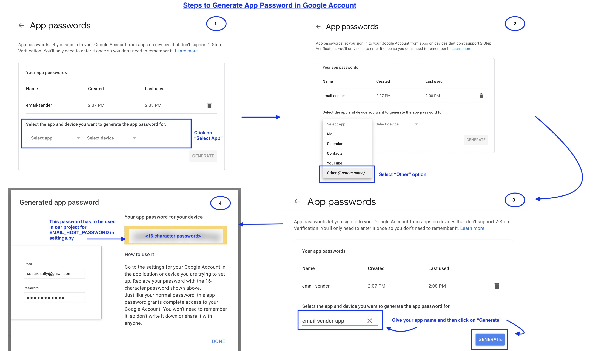

# Django Example OTP Login

This repository provides a Django example implementation of OTP (One-Time Password) login functionality. Users can receive an OTP via email and use it for authentication.

## Installation

Follow the steps below to set up and run the project locally:

### 1\. Clone the Repository

```
git clone https://github.com/your-username/django-otp-login.git

cd django-otp-login
```

### 2\. Install Dependencies

`pip install -r requirements.txt` 

### 3\. Configure Email Settings

Open the `settings.py` file in your Django project directory and update the email configuration with your email details:


```
# settings.py

EMAIL_BACKEND = 'django.core.mail.backends.smtp.EmailBackend'
EMAIL_HOST_USER = 'your-email@gmail.com'  # Replace with your email
EMAIL_HOST = 'smtp.gmail.com'
EMAIL_PORT = 587
EMAIL_HOST_PASSWORD = 'your-app-password'  # Replace with your app password
EMAIL_USE_TLS = True
``` 
#### Mandatory Changes in Your Gmail Account

1. Go to [https://myaccount.google.com/security](https://myaccount.google.com/security).
    
2. Scroll down until you find the **Signing in to Google** section.
    
    - Within that section, locate the "App Passwords" option, as illustrated in the image below:
        
        
        
    - Click on **App Passwords**, and you'll be prompted to enter your Gmail account password. After entering it, the page will open.
        
    - Follow the steps outlined in the image below to set up your app password.
        
        
        

Completing the above steps is crucial for sending emails from your Gmail account using your Django code.

If you have any further questions or concerns, feel free to ask.

Make sure to replace `'your-email@gmail.com'` and `'your-app-password'` with your actual email address and the generated app password for your email provider.

### 4\. Apply Migrations

Run the following command to apply database migrations:

bashCopy code

`python manage.py migrate` 

### 5\. Run the Development Server

Start the Django development server:

bashCopy code

`python manage.py runserver` 

Visit http://localhost:8000/ in your web browser to access the application.

## Usage

1. Navigate to the registration page and provide your email.
2. Check your email for the OTP.
3. Enter the received OTP to complete the registration process.